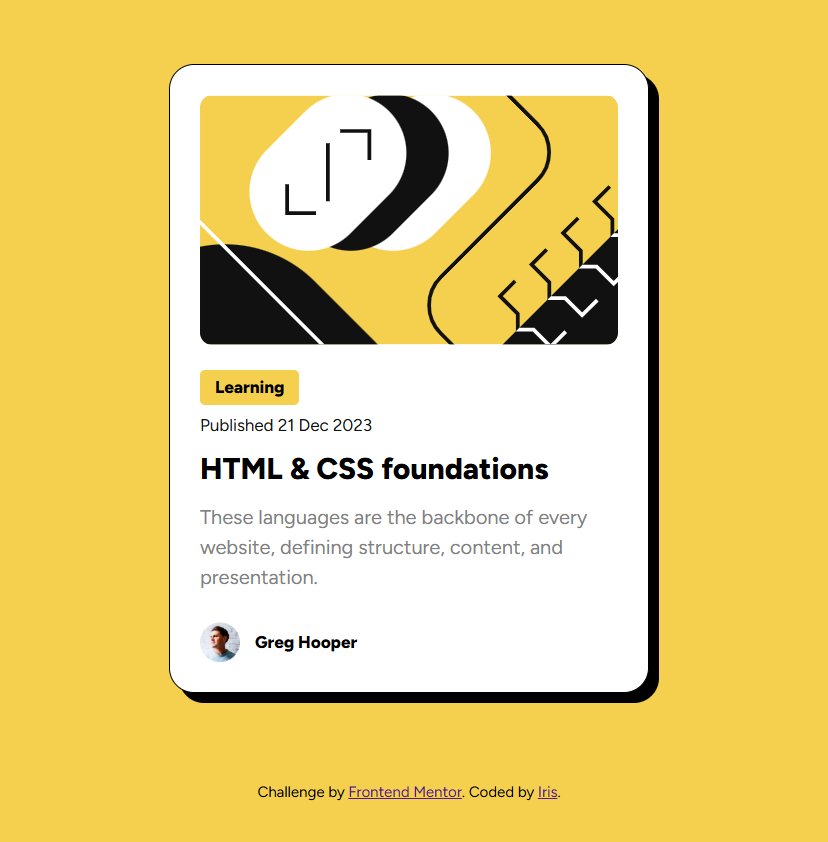

# Frontend Mentor – Blog Preview Card

This is a solution to the [Blog Preview Card](https://www.frontendmentor.io/challenges/blog-preview-card-ckPaj01IcS) challenge on Frontend Mentor. The goal of this challenge is to practice building a simple and responsive layout using only HTML and CSS.

## Table of contents

- [Overview](#overview)
- [My process](#my-process)
  - [Screenshot](#screenshot)
- [Live site](#live-site)
  - [Built with](#built-with)
  - [Responsive design](#responsive-design)
  - [What I learned](#what-i-learned)
  - [Challenges faced](#challenges-faced)
- [Author](#author)

## Overview

## My process

### How I approached it

I started by analyzing the Figma design to understand the structure, layout, and spacing. Then, I created a clean semantic HTML structure and styled it using custom CSS. I used Flexbox for alignment and spacing, followed a mobile-first approach, and carefully matched the design's colors, typography, and layout.

## 📸 Screenshot

## 🔗 Live site

👉 [Live Demo](https://blog-card-frontend-challenge.netlify.app/)

---

## 🛠️ Built with

- Semantic HTML5 markup
- CSS custom properties
- Flexbox
- Google Fonts (Figtree)

---

## 📱 Responsive design

The layout is fully responsive and adapts to different screen sizes:

- Mobile: `375px`
- Desktop: `1440px`

---

## 🚀 What I learned

- Building clean and structured cards using HTML and CSS
- Using `box-shadow` to simulate 3D effects
- Aligning content using Flexbox
- Debugging spacing issues in attribution with `&nbsp;`

---

## 🧠 Challenges faced

- Adding consistent spacing after links in the attribution footer
- Choosing when to use `px` vs `rem` for sizing and spacing
- Keeping layout balanced across different screen widths

---

## Author

Coded by I-RI-S.
